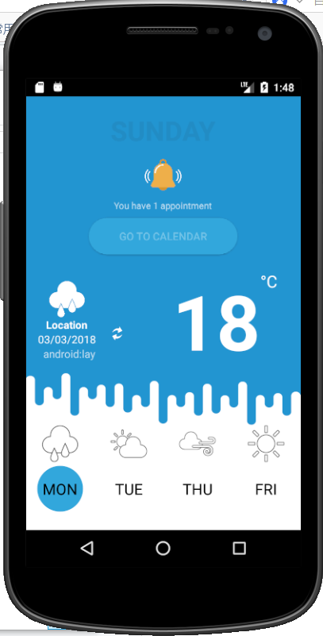
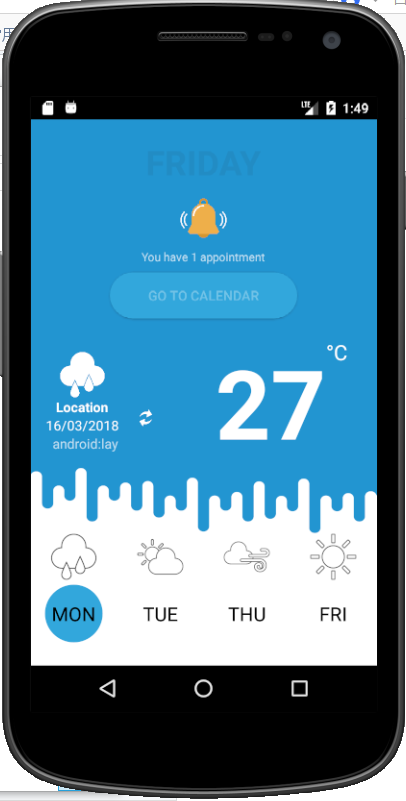

# Weather application

then I make it looks better.
changes includ:
 adding the new icon to the application,  
 adding the blue background,  
 adding the refresh button,  
 when the refresh button is pressed, the temperature, the date and the day of the week are all updated. 
 
 (I can not upload gif, so, there only are some png pictures.)
 At the begining: 
  
 after click: 
 
